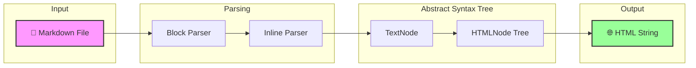

# 🧵 Loom: Weaving Markdown into the Web

<div align="center">

**A zero-dependency Static Site Generator written in Python (3.12+)**

*Built from scratch for educational purposes — no external libraries, just pure Python.*

[](https://www.python.org/downloads/)
[](LICENSE)
[](CONTRIBUTING.md)

</div>

---

## 📖 About

**Loom** is a minimalist Static Site Generator (SSG) designed as a learning tool for computer science students and aspiring developers. Unlike production SSGs that rely on external libraries, Loom implements everything from first principles:

- **Regex-based parsing** — Learn how parsers tokenize text
- **Tree data structures** — Understand ASTs through our `TextNode` → `HTMLNode` pipeline
- **Recursive algorithms** — See recursion in action when rendering nested structures
- **File system operations** — Work with Python's `pathlib` for file management

> **Philosophy:** By avoiding dependencies, Loom exposes the inner workings of document processing that most tools hide behind abstractions.

---

## 🏗️ Architecture

Loom follows a clean, linear pipeline to transform Markdown into HTML:



See **[ARCHITECTURE.md](ARCHITECTURE.md)** for a detailed explanation of Loom’s parsing pipeline and internal design.


### Pipeline Breakdown

| Stage | File | Description |
|-------|------|-------------|
| **Block Parsing** | `block.py` | Splits Markdown into blocks (paragraphs, headings, code, lists, quotes) |
| **Inline Parsing** | `inline.py` | Processes inline elements (bold, italic, code, links, images) |
| **Text Nodes** | `textnode.py` | Intermediate representation of parsed text with type information |
| **HTML Nodes** | `htmlnode.py`, `leafnode.py`, `parentnode.py` | Tree structure for HTML generation |
| **Rendering** | `main.py` | Orchestrates the pipeline and generates final HTML files |

---

## 🚀 Quick Start

### Prerequisites

- Python 3.12 or higher
- Git

### Installation

```bash
# Clone the repository
git clone https://github.com/your-username/loom.git
cd loom

# No dependencies to install! 🎉
```

### Generate the Static Site

```bash
# Option 1: Run directly
python3 src/main.py

# Option 2: Use the build script
./build.sh
```

### Preview Locally

```bash
# Serve the generated site
python3 -m http.server 8000 -d docs

# Open in your browser: http://localhost:8000
```

---

## 📂 Project Structure

```
loom/
├── src/                    # Core source code
│   ├── main.py             # Entry point & orchestration
│   ├── block.py            # Block-level Markdown parsing
│   ├── inline.py           # Inline element parsing
│   ├── textnode.py         # TextNode class & conversion
│   ├── htmlnode.py         # Base HTMLNode class
│   ├── leafnode.py         # Leaf nodes (no children)
│   ├── parentnode.py       # Parent nodes (with children)
│   └── test_*.py           # Unit tests
│
├── content/                # Your Markdown content
│   ├── index.md            # Homepage
│   ├── blog/               # Blog posts
│   └── contact/            # Contact page
│
├── static/                 # Static assets (copied as-is)
│   └── css/                # Stylesheets, images, etc.
│
├── docs/                   # Generated output (for GitHub Pages)
│
├── template.html           # HTML template with {{ Title }} and {{ Content }}
├── build.sh                # Build script
└── test.sh                 # Test runner
```

### Key Directories

| Directory | Purpose |
|-----------|---------|
| `content/` | Write your Markdown files here. Directory structure is preserved in output. |
| `static/` | Place CSS, images, and other assets. Copied directly to `docs/`. |
| `docs/` | **Generated output.** Serve this folder or configure GitHub Pages to use it. |

---

## 🧪 Running Tests

```bash
# Run all unit tests
./test.sh

# Or run directly with unittest
python3 -m unittest discover -s src
```

> **Note:** Some tests may be failing or have incorrect assertions. See [CONTRIBUTING.md](CONTRIBUTING.md) for details on how fixing tests is a valid contribution!

---

## 🤝 Contributing

We welcome contributions, especially from students learning about:
- Parser design and regular expressions
- Tree data structures and recursion
- Python best practices

See **[CONTRIBUTING.md](CONTRIBUTING.md)** for a complete guide on getting started.

---

## 📜 License

This project is open-source and available under the [MIT License](LICENSE).

---

<div align="center">

**Happy weaving! 🧵**

*Built with ❤️ for education*

</div>
