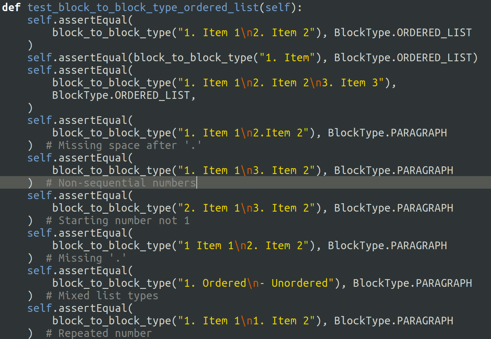
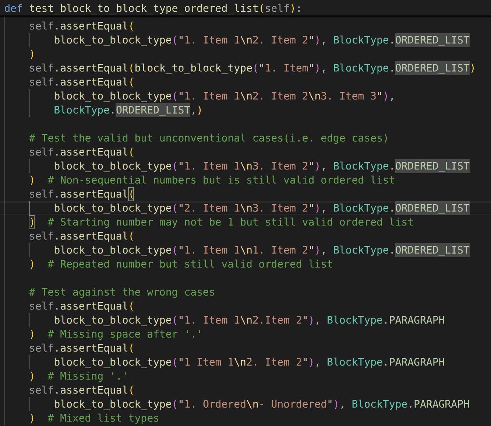
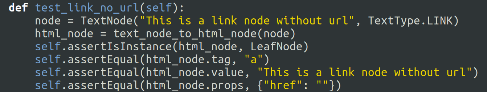
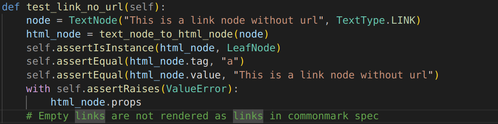

# Static File Generator – Audit Test Report

**Project:** Static File Generator  
**Report Type:** Audit & Test Compliance Report  
**Name:** Samriddha Sahu  
**Submission Date:** 27/12/2025  

---

## Summary

This report documents the audit findings for the Static File Generator project with respect to unit tests and CommonMark compliance.  
The objective of the audit was to:

- Fix incorrect or outdated unit tests
- Add missing test coverage for edge cases
- Execute the full test suite against the target implementation
- Identify failing behaviors and infer required code changes

A total of **126 tests** were executed. The audit revealed **12 failing tests** and **1 error**, primarily related to Markdown edge cases such as italics parsing, links with empty URLs, code span handling and table parsing.

---

## Table of Contents

1. Fixed Tests  
2. Tests Added  
3. Test Execution Results  
4. Conclusion  

---

## 1. Fixed Tests

The following test files were modified to correct incorrect assertions:

- `test_block.py`
- `test_textnode.py`
- `test_table.py`

### 1.1 Changes in `test_block.py`

In `test_block_to_block_type_ordered_list(self)`, incorrect `assert_equals` statements were updated to align with expected CommonMark behavior.


<figure>
  
  <figcaption>Before changes</figcaption>
</figure>
<figure>
  
  <figcaption>After changes</figcaption>
</figure>

### 1.2 Changes in `test_textnode.py`

In `test_link_no_url(self)`, the assertion was corrected to allow empty URLs without raising errors.

<figure>
  
  <figcaption>Before changes</figcaption>
</figure>
<figure>
  
  <figcaption>After changes</figcaption>
</figure>

### 1.3 Changes in `test_table.py`

Changed the testing method by comparing using Abstract Syntax Tree method rather than comparing whole html string.

---

## 2. Tests Added

Additional tests were introduced to improve coverage of edge cases and specification compliance.

### 2.1 Updated Test Files

- `test_inline.py`
- `test_block.py`
- `test_html_node.py`
- `test_leafnode.py`
- `test_parentnode.py`
- `test_table.py`

### 2.2 Inline Parsing Tests (`test_inline.py`)

The following tests were added:

- `test_only_italic_with_no_flanking_whitespace`
- `test_only_italic_with_asterik`
- `test_mismatched_delimiters_no_italics`
- `test_backslash_escapes_italics`
- `test_code_span_with_backtick_inside`
- `test_link_with_empty_url`
- `test_link_with_parentheses_in_url`
- `test_image_with_empty_alt`

### 2.3 Block Parsing Tests (`test_block.py`)

#### Heading Tests (`test_block_to_block_type_heading`)

```python
self.assertEqual(block_to_block_type("## Heading 2 ##"), BlockType.HEADING)
self.assertEqual(block_to_block_type("# "), BlockType.HEADING)
self.assertEqual(block_to_block_type(" # H1"), BlockType.HEADING)
self.assertEqual(block_to_block_type(" # H1"), BlockType.PARAGRAPH)
```

#### Code Tests (`test_block_to_block_type_code`)

```python
self.assertEqual(block_to_block_type("``````"), BlockType.CODE)
```

#### Quote Tests
```python
self.assertEqual(block_to_block_type("  > Quote"), BlockType.QUOTE)
self.assertEqual(block_to_block_type("   > Quote"), BlockType.PARAGRAPH)
```

#### Unordered List Test

```python
self.assertEqual(block_to_block_type("-Item"), BlockType.PARAGRAPH)
```

### 2.4 Parent Node Tests (test_parentnode.py)

- `test_parent_node_inherits_from_htmlnode(self)`
- `test_to_html_mixed_children(self)`
- `test_table_structure(self)`
- `test_props_with_class(self)`

### 2.5 Leaf Node Tests (test_leafnode.py)

- `test_leaf_node_inherits_from_htmlnode(self)`
- `test_leaf_node_no_children(self)`
- `test_to_html_with_multiple_props(self)`
- `test_to_html_empty_value_raises_error(self)`
- `test_value_with_special_html_characters(self)`
- `test_value_with_html_entities(self)`
- `test_very_long_value(self)`
- `test_custom_tag(self)`

### 2.6 HTML Node Tests (test_htmlnode.py)

- `test_props_with_quotes_in_value(self)`
- `test_props_with_empty_string_value(self)`
- `test_props_with_numeric_value(self)`
- `test_props_with_style_attribute(self)`

### 2.7 Table Tests (test_table.py)
- `header_row_delimeter_row_mismatch`
- `escape_pipe_using_backtick`

<div style="page-break-after: always;"></div>

---

## 3. Test Execution Results

The complete test suite was executed against the reference implementation.

- **Total Tests:** 126  
- **Failures:** 12  
- **Errors:** 1  
- **Execution Time:** 0.006 seconds  

### 3.1 Error Encountered

- `test_code_span_with_backtick_inside` (`test_inline.py`)

### 3.2 Failed Tests

- `test_block_to_block_type_heading`
- `test_block_to_block_type_ordered_list`
- `test_block_to_block_type_unordered_list`
- `test_escaped_italics`
- `test_image_with_empty_alt`
- `test_link_with_empty_url`
- `test_link_with_parentheses_in_url`
- `test_only_italic_with_asterik`
- `test_only_italic_with_no_flanking_whitespace`
- `test_table_mismatched_cells_with_alignment`
- `test_table_with_more_body_cells`
- `test_link_no_url`

Detailed failure logs are available in `test_outcome.txt` or `test_log_screenshot.pdf`. 

<div style="page-break-after: always;"></div>

---

## 4. Inference from Failed Tests & Required Code Changes


Based on the failed tests, the following code changes are required:

- Add **single-asterisk italic support**
- Implement **flanking underscore rules**
  - `my_variable_name` → plain text
  - `my _variable_ name` → italicized
- Remove **sequential numbering validation** in ordered lists
- Allow **0–3 leading spaces** in heading detection
- Update regex to allow:
  - empty URLs
  - empty image alt text
  - parentheses inside URLs
- Add **backslash escape handling** for inline formatting
- Support **double-backtick code spans**
- Ensure GFM compliance with regard to tables
  - extra cells in `<tbody>` should not be rendered
- Ensure empty URLs do not raise runtime errors

---

## Conclusion

This audit highlights several specification-level edge cases that require implementation changes for full CommonMark compliance. Once the identified issues are resolved, the Static File Generator is expected to pass the complete test suite successfully.

---

**End of Report**
